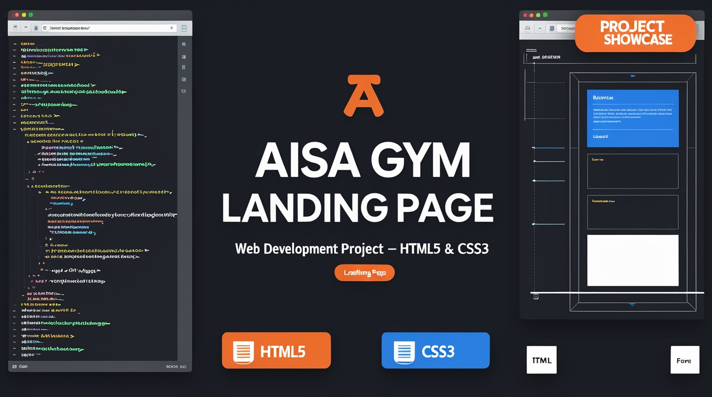

# 💪 AISA Gym - Landing Page




> **A modern, responsive landing page for a fitness center with member registration, contact information, and navigation to key services.**

---

## 📋 Table of Contents

- [Overview](#overview)
- [Features](#features)
- [Demo](#demo)
- [File Structure](#file-structure)
- [Technologies Used](#technologies-used)
- [Installation](#installation)
- [Usage](#usage)
- [Customization](#customization)
- [Screenshots](#screenshots)
- [Browser Compatibility](#browser-compatibility)
- [Contributing](#contributing)
- [Future Enhancements](#future-enhancements)
- [License](#license)
- [Contact](#contact)

---

## 🎯 Overview

**AISA Gym** is a clean, professional landing page designed for fitness centers and gyms. The page features a full-screen background image, intuitive navigation, registration form, and social media integration. Built with pure HTML5 and CSS3, it provides an engaging first impression for potential gym members.

### Key Highlights:
- 🏋️ Full-screen background gym imagery
- 📝 Member registration form
- 🌐 Social media integration
- 📱 Contact information panel
- 🎨 Modern cyan and white color scheme
- ⚡ Lightweight and fast loading
- 🎯 Clear call-to-action buttons

---

## ✨ Features

### 🖥️ User Interface
- **Hero Section**: Eye-catching full-screen gym background
- **Logo Branding**: Circular logo with gym name
- **Navigation Bar**: Easy access to all sections
- **Registration Form**: Quick member sign-up
- **Social Links**: Direct connections to social platforms

### 📋 Navigation Menu
- **HOME**: Main landing page
- **ABOUT**: Business information and strategy
- **CENTERS**: Location finder via Google Maps
- **MEMBERSHIP**: Registration through JotForm
- **CALL US**: WhatsApp integration

### 📞 Contact Panel
- Email
- WhatsApp
- Facebook
- Instagram
- Twitter
- Snapchat

### 📝 Registration Form Fields
- Name (Text input)
- Age (Number input)
- Address (Text input)
- Mobile Number (Number input)
- Email (Email input with validation)
- Submit Button

### 🎨 Design Features
- Hover effects on navigation links
- Interactive form inputs
- Smooth transitions
- Responsive button styles
- Professional color scheme

---

## 🎬 Demo

### Landing View
```
┌─────────────────────────────────────────────────┐
│  [Logo] AISA              Navigation Menu       │
│                                        Contacts  │
├─────────────────────────────────────────────────┤
│                                                  │
│   Join the best gym center near you.           │
│                                                  │
│   REGISTER NOW!                                 │
│   [Name Input]                                  │
│   [Age Input]                                   │
│   [Address Input]                               │
│   [Mobile Input]                                │
│   [Email Input]                                 │
│   [Submit Button]                               │
│                                                  │
└─────────────────────────────────────────────────┘
```

---

## 📁 File Structure

```
aisa-gym-landing-page/
│
├── 📂 landing_page/
│   ├── 📄 landing_page.html            # Main HTML file
│   ├── 🎨 landing_page.css             # Stylesheet
│   └── 🖼️ gym_bckgrnd img.jpg          # Background image
│
├── 📂 assets/                          # (Optional) Additional assets
│   ├── images/
│   │   ├── logo.png                    # Gym logo
│   │   └── background.jpg              # Alternative backgrounds
│   └── icons/
│       └── favicon.ico                 # Browser favicon
│
├── 📖 README.md                        # Project documentation
└── 📜 LICENSE                          # License file
```

---

## 🛠️ Technologies Used

| Technology | Purpose | Version |
|------------|---------|---------|
|  | Structure and markup | 5 |
|  | Styling and layout | 3 |
|  | Typography | System fonts |

### External Services
- **Google Maps**: Location integration
- **JotForm**: Membership form processing
- **WhatsApp Web**: Direct messaging
- **Social Media**: Facebook, Instagram, Twitter, Snapchat

---

## 🚀 Installation

### Prerequisites
- A modern web browser (Chrome, Firefox, Safari, Edge)
- Text editor (VS Code, Sublime Text, Atom)
- Basic knowledge of HTML/CSS
- Web server (optional, for local testing)

### Quick Start

1. **Clone the repository**
```bash
git clone https://github.com/yourusername/aisa-gym-landing.git
cd aisa-gym-landing
```

2. **Navigate to the landing page folder**
```bash
cd landing_page
```

3. **Open in browser**
```bash
# Double-click the HTML file, or
# Right-click → Open with → Your Browser

# Or use a local server (recommended)
python -m http.server 8000
# Visit: http://localhost:8000
```

4. **Start customizing**
- Edit `landing_page.html` for content
- Modify `landing_page.css` for styling
- Replace background image with your own

---

## 💻 Usage

### Basic Setup

1. **Add Your Gym Details**
```html
<!-- In landing_page.html -->
<div class="left">
    
    YOUR GYM NAME
</div>
```

2. **Update Navigation Links**
```html
<li><a href="YOUR_ABOUT_PAGE.html">ABOUT</a></li>
<li><a href="YOUR_LOCATION_LINK">CENTERS</a></li>
<li><a href="YOUR_MEMBERSHIP_FORM">MEMBERSHIP</a></li>
```

3. **Configure Form Action**
```html
<form action="your-backend-script.php" method="POST">
    <!-- Form fields -->
</form>
```

4. **Update Social Media Links**
```html
<li><a href="https://facebook.com/yourgym">Facebook</a></li>
<li><a href="https://instagram.com/yourgym">Instagram</a></li>
```

### Adding Background Image

**Option 1: Local Image**
```css
body {
    background-image: url("your-image.jpg");
    background-size: cover;
    background-position: center;
    background-attachment: fixed;
}
```

**Option 2: External URL**
```css
body {
    background-image: url("https://example.com/gym-image.jpg");
}
```

---

## 🎨 Customization

### Color Scheme

Current colors:
```css
/* Primary Colors */
--primary-cyan: cyan;
--text-white: aliceblue;
--text-dark: darkblue;
--bg-button: blanchedalmond;
--hover-dark: rgb(8, 8, 8);

/* Backgrounds */
--transparent: transparent;
```

### Changing Color Theme

**Example: Purple Theme**
```css
/* In landing_page.css, replace: */
.navbar li a {
    color: #9b59b6; /* Purple instead of cyan */
}

.navbar li a:hover {
    color: #8e44ad; /* Dark purple */
}
```

### Typography

Current fonts:
- Headings: `'Trebuchet MS'`
- Navigation: `'Times New Roman'`
- Body: `'Gill Sans'`
- Form: `'Franklin Gothic Medium'`

**Change fonts:**
```css
.left {
    font-family: 'Your Font', sans-serif;
}
```

### Button Styles

```css
.btn {
    background-color: #your-color;
    border-radius: 10px;
    width: 255px;
    height: 37px;
    font-size: 16px;
    font-weight: bold;
}
```

### Layout Adjustments

**Adjust container position:**
```css
.container {
    margin-top: 130px;    /* Vertical spacing */
    margin-left: 250px;   /* Horizontal position */
}
```

---

## 📸 Screenshots

### Desktop View
```
┌─────────────────────────────────────────────────────────┐
│  [🏋️ Logo] AISA         [Navigation Menu]    [Contacts] │
├─────────────────────────────────────────────────────────┤
│                                                          │
│  [Full-screen gym background image]                     │
│                                                          │
│  Join the best gym center near you.                     │
│  REGISTER NOW!                                          │
│                                                          │
│  [Registration Form]                                     │
│                                                          │
└─────────────────────────────────────────────────────────┘
```

### Features Showcase
- **Navigation Hover**: Links underline and change color
- **Form Inputs**: Gray background on hover
- **Submit Button**: Dark transition effect
- **Contact Links**: Italic style with underline hover

---

## 🌐 Browser Compatibility

| Browser | Supported | Version |
|---------|-----------|---------|
|  | ✅ Yes | Latest |
|  | ✅ Yes | Latest |
|  | ✅ Yes | 12+ |
|  | ✅ Yes | Latest |
|  | ✅ Yes | Latest |
|  | ⚠️ Limited | Not recommended |

---

## 📱 Responsive Design

### Current Status
- ⚠️ **Desktop Optimized**: Best viewed on screens 1024px+
- ⚠️ **Mobile**: Requires responsive improvements

### Recommended Mobile Updates

```css
/* Add to landing_page.css */
@media screen and (max-width: 768px) {
    .left {
        width: 100%;
        position: relative;
        text-align: center;
    }
    
    .mid {
        width: 100%;
        margin: 0;
        padding: 0;
    }
    
    .navbar li {
        display: block;
        padding: 5px;
    }
    
    .right {
        position: relative;
        right: auto;
        text-align: center;
    }
    
    .container {
        margin: 20px auto;
        padding: 0 20px;
        width: 90%;
    }
    
    .form-group input {
        width: 100%;
    }
}
```

---

## 🤝 Contributing

We welcome contributions! Here's how you can help:

### Ways to Contribute

1. **Report Bugs** 🐛
   - Check if issue already exists
   - Provide detailed steps to reproduce
   - Include browser and OS information

2. **Suggest Features** 💡
   - Open a feature request issue
   - Describe the feature clearly
   - Explain the use case

3. **Submit Pull Requests** 🔧
   - Fork the repository
   - Create a feature branch
   - Make your changes
   - Test thoroughly
   - Submit PR with clear description

### Development Guidelines

```bash
# Fork and clone
git clone https://github.com/YOUR_USERNAME/aisa-gym-landing.git

# Create branch
git checkout -b feature/your-feature-name

# Make changes and commit
git add .
git commit -m "Add: your feature description"

# Push and create PR
git push origin feature/your-feature-name
```

### Code Style
- Use consistent indentation (2 or 4 spaces)
- Add comments for complex CSS
- Use semantic HTML5 tags
- Keep CSS organized by sections
- Test on multiple browsers

---

## 🚀 Future Enhancements

### Planned Features

- [ ] **Responsive Design**
  - Mobile-first approach
  - Tablet optimization
  - Hamburger menu for mobile

- [ ] **Backend Integration**
  - PHP/Node.js form processing
  - Database storage for registrations
  - Email confirmation system

- [ ] **Additional Pages**
  - About Us page
  - Classes & Programs
  - Trainers profile
  - Pricing plans
  - Blog/News section
  - Gallery page

- [ ] **Interactive Features**
  - Image slider/carousel
  - Video background option
  - BMI calculator
  - Class schedule calendar
  - Testimonials section

- [ ] **Performance**
  - Image optimization
  - Lazy loading
  - CSS minification
  - CDN integration

- [ ] **SEO Optimization**
  - Meta tags
  - Schema markup
  - Sitemap
  - Analytics integration

- [ ] **Accessibility**
  - ARIA labels
  - Keyboard navigation
  - Screen reader support
  - High contrast mode

- [ ] **JavaScript Enhancements**
  - Form validation
  - Smooth scrolling
  - Animations
  - Modal popups
  - Loading states

---

## 📊 Performance Checklist

### Current Status
- [x] HTML5 semantic markup
- [x] CSS3 styling
- [x] External links configured
- [ ] Mobile responsive
- [ ] Form validation
- [ ] SEO optimized
- [ ] Accessibility compliant
- [ ] Performance optimized

### Optimization Tips

**Images:**
```bash
# Compress background image
# Recommended: WebP format, max 500KB
# Tools: TinyPNG, ImageOptim, Squoosh
```

**CSS:**
```css
/* Minify for production */
/* Remove unused styles */
/* Combine similar selectors */
```

**Loading:**
```html
<!-- Add to <head> for faster loading -->
<link rel="preload" as="image" href="gym_bckgrnd img.jpg">
```

---

## 🔧 Troubleshooting

### Common Issues

**Background image not showing:**
```css
/* Check file path */
body {
    background-image: url("./gym_bckgrnd\ img.jpg");
    /* or */
    background-image: url("gym_bckgrnd%20img.jpg");
}
```

**Form not submitting:**
```html
<!-- Update action attribute -->
<form action="submit.php" method="POST">
```

**Links not working:**
```html
<!-- Use full URLs for external links -->
<a href="https://www.google.com/maps">CENTERS</a>
```

**Layout breaking on mobile:**
```css
/* Add viewport meta tag */
<meta name="viewport" content="width=device-width, initial-scale=1.0">
```

---

## 📝 Form Integration

### Backend Options

**1. PHP Processing:**
```php
<?php
// noaction.php
if ($_SERVER["REQUEST_METHOD"] == "POST") {
    $name = htmlspecialchars($_POST['name']);
    $age = htmlspecialchars($_POST['age']);
    $address = htmlspecialchars($_POST['address']);
    $mobile = htmlspecialchars($_POST['mobile']);
    $email = htmlspecialchars($_POST['email']);
    
    // Save to database or send email
    // Redirect to thank you page
}
?>
```

**2. JavaScript Validation:**
```javascript
// Add to HTML before </body>
<script>
document.querySelector('form').addEventListener('submit', function(e) {
    const email = document.querySelector('input[type="email"]').value;
    const mobile = document.querySelector('input[type="number"]').value;
    
    if (!email.includes('@')) {
        alert('Please enter a valid email');
        e.preventDefault();
    }
});
</script>
```

**3. Third-party Services:**
- **Formspree**: No backend required
- **Google Forms**: Free and easy
- **Netlify Forms**: Built-in form handling
- **EmailJS**: Direct email sending

---

## 🎯 SEO Optimization

### Recommended Meta Tags

```html
<head>
    <meta charset="UTF-8">
    <meta name="viewport" content="width=device-width, initial-scale=1.0">
    <meta name="description" content="AISA Gym - Best fitness center near you. Join now for expert training, modern equipment, and personalized fitness programs.">
    <meta name="keywords" content="gym, fitness, workout, training, health, AISA gym">
    <meta name="author" content="AISA Gym">
    
    <!-- Open Graph for social sharing -->
    <meta property="og:title" content="AISA Gym - Join the Best Fitness Center">
    <meta property="og:description" content="Transform your body with expert trainers and modern facilities">
    <meta property="og:image" content="gym-social-preview.jpg">
    <meta property="og:url" content="https://aisagym.com">
    
    <!-- Favicon -->
    <link rel="icon" type="image/png" href="favicon.png">
    
    <title>AISA Gym - Best Fitness Center Near You</title>
</head>
```

---


## 🙏 Acknowledgments

- **Background Image**: Fitness photography sources
- **Inspiration**: Modern gym websites
- **Icons**: Social media platforms
- **Fonts**: System default fonts
- **Community**: Open-source contributors


---


## 🎓 Learning Resources

### HTML & CSS Tutorials
- [MDN Web Docs](https://developer.mozilla.org/)
- [W3Schools](https://www.w3schools.com/)
- [CSS Tricks](https://css-tricks.com/)

### Design Inspiration
- [Dribbble](https://dribbble.com/tags/gym-website)
- [Behance](https://www.behance.net/search/projects?search=fitness+landing)
- [Awwwards](https://www.awwwards.com/)

### Tools
- [CSS Gradient Generator](https://cssgradient.io/)
- [Color Palette](https://coolors.co/)
- [Image Compressor](https://tinypng.com/)

---

<div align="center">

### Made with 💪 for Fitness Enthusiasts

**"The only bad workout is the one that didn't happen."**

⭐ **Star this repo if you find it useful!** ⭐

</div>

---

**Last Updated**: October 2025 | **Version**: 1.0.0 |